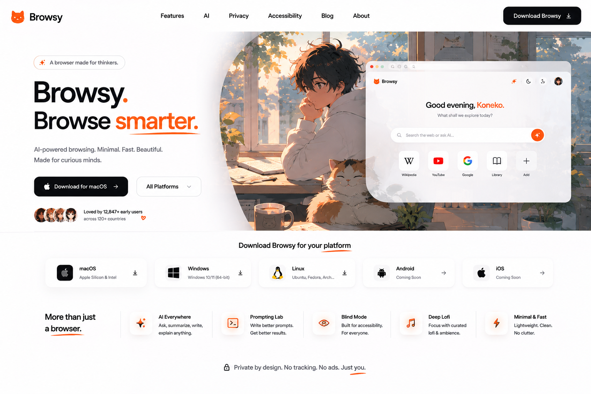

<h1> Browsy is built for People who wants productivity</h1>

<h2>📁 Structure</h2>
<pre>
Browsy/
├── core/
├── network/
├── renderer/
├── js_engine/
├── storage/
├── ui/
├── platform/
├── tests/
├── assets/
├── docs/
└── main.py
</pre>

<h1>Website to download it from! </h1>

<h1>Browsy</h1>

A modular experimental web browser architecture designed to explore rendering engines, networking pipelines, and execution runtimes.

<h2>1. System Architecture</h2>

Browsy is structured as a layered pipeline where each subsystem is isolated and communicates through well-defined interfaces.
The architecture follows a unidirectional flow to reduce coupling and improve testability.

<pre>
User Input
    ↓
UI Layer
    ↓
Core (Navigation + Scheduling)
    ↓
Network Stack (HTTP / HTTPS / DNS)
    ↓
Render Engine (HTML/CSS → Layout → Paint)
    ↓
Output Surface (Platform abstraction)
</pre>

<h2>2. Core Design Philosophy</h2>

The system is designed around separation of concerns and deterministic data flow.
Each subsystem operates on immutable inputs and produces structured outputs.

<pre>
class IBrowserComponent {
public:
    virtual void init() = 0;
    virtual void shutdown() = 0;
    virtual ~IBrowserComponent() = default;
};
</pre>

All modules in Browsy implement a unified interface contract allowing runtime substitution of components.

<h2>3. Core Layer</h2>

The Core layer orchestrates navigation, tab lifecycle, and event dispatching.
It acts as the central scheduler of browser state transitions.

<pre>
class BrowserCore {
private:
    std::vector<Tab> tabs;
    NetworkClient network;
    RenderPipeline renderer;

public:
    void openURL(const std::string& url) {
        auto response = network.fetch(url);
        renderer.render(response.body);
    }
};
</pre>

The Core layer does not perform rendering or networking directly. It delegates to specialized subsystems.

<h2>4. Network Stack</h2>

The network subsystem implements a minimal HTTP client with support for connection reuse and response streaming.
DNS resolution is abstracted into a separate resolver module.

<pre>
class HttpClient {
public:
    HttpResponse get(const std::string& url);
};
</pre>

<pre>
HttpResponse HttpClient::get(const std::string& url) {
    TcpConnection conn = TcpConnection::connect(resolveHost(url));
    conn.write(buildHttpRequest("GET", url));

    return parseHttpResponse(conn.readAll());
}
</pre>

Future extensions include TLS handshake integration, HTTP/2 multiplexing, and caching middleware.

<h2>5. Rendering Engine</h2>

The rendering engine is composed of four sequential stages:
HTML parsing, DOM construction, style resolution, layout computation, and painting.

<pre>
struct RenderNode {
    std::string tag;
    std::vector<RenderNode*> children;
    StyleComputed style;
};
</pre>

Rendering pipeline:

<pre>
class RenderPipeline {
public:
    void render(const std::string& html) {
        DOM dom = HTMLParser::parse(html);
        StyleTree styles = CSSResolver::resolve(dom);
        LayoutTree layout = LayoutEngine::compute(dom, styles);
        Painter::draw(layout);
    }
};
</pre>

<h2>6. DOM Representation</h2>

The DOM is represented as a tree structure optimized for traversal during layout and paint passes.

<pre>
struct DOMNode {
    std::string tag;
    std::string text;
    std::vector<DOMNode*> children;
};
</pre>

<h2>7. JavaScript Runtime (Planned)</h2>

The JavaScript engine is designed as a sandboxed execution environment with a garbage-collected heap and event loop integration.

<pre>
class JSRuntime {
public:
    void execute(const std::string& script);
};
</pre>

Planned features include:
- AST interpreter or bytecode VM
- DOM bindings
- async event loop integration

<h2>8. Platform Abstraction Layer</h2>

The platform layer isolates OS-specific functionality such as window creation, input handling, and GPU surface management.

<pre>
class Window {
public:
    virtual void create(int width, int height) = 0;
    virtual void drawFrame(const FrameBuffer& buffer) = 0;
};
</pre>

This allows Browsy to be ported across Windows, Linux, and macOS without modifying upper layers.

<h2>9. Storage Subsystem</h2>

Persistent browser state is managed through a structured storage layer.

<pre>
class CacheStore {
public:
    void put(const std::string& key, const std::string& value);
    std::string get(const std::string& key);
};
</pre>

Storage includes:
- HTTP cache
- cookies
- session storage
- browsing history

<h2>10. Design Constraints</h2>

- No subsystem is allowed to directly access another subsystem internals.
- Communication must occur through defined interfaces.
- Rendering must remain deterministic given identical inputs.
- Network layer must remain stateless outside connection pooling.

<h2>11. Build Vision</h2>

Browsy is intended as an incremental reconstruction of browser internals.
The objective is not production parity but structural clarity of modern web engines.

